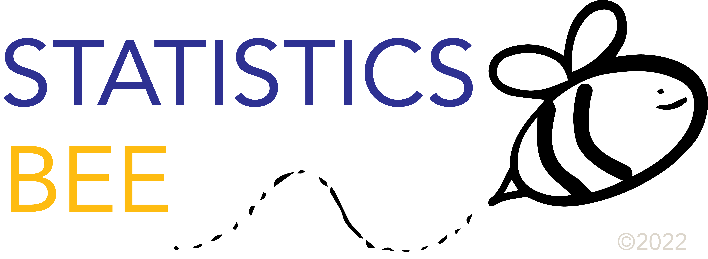

---
output:
  xaringan::moon_reader:
    lib_dir: libs
    nature:
      highlightStyle: github
      highlightLines: true
      countIncrementalSlides: false
---
class: center, middle


<br>

# A Proposal
## Submitted by: Ethan P. Marzban

---

# Background: MIT Integration Bee

--

- https://math.mit.edu/~yyao1/integrationbee.html

--

- On its 41st annual iteration

--

- Started at MIT; has since spread to include schools such as UC Berkeley, UW Madison (Physics Department), 

--

- Basic premise: much like a Spelling Bee, but with integrals in place of words.

--

    - Initially, students undergo a Qualifying Exam: example of the most recent qualifying exam (2022): https://math.mit.edu/~yyao1/pdf/qualifying_round_2022_test.pdf
  
--

    - Students then face off in pairs to see who can evaluate a given integral correctly, in the least amount of time.

--

- A question: how can we adapt an Integration-Bee-style event to the field of Statistics and Probability?

--

- A Statistics Bee! 

---

# The Statistics Bee

--

- A full Handbook of rules and regulations can be found: [here](https://drive.google.com/file/d/1zYEMdVLg7rUngZLvmlBx_-Vn1fNr2k_L/view?usp=sharing)

--

- General structure borrowed from Integration bee:

--

    - Qualifying Round
    - Playoff Round

--

- Instead of integrals, problems will be drawn from the fields of: Expectations (much like integrals), and Transformations

--

- **Expectations:** A density will be provided, and contestants must compute the corresponding expectation.

--

- **Transformations:** A random variable $X$ will be provided, and a new random variable $Y$, defined as a function of $X$, will also be provided; contestants must compute the density of $Y$ (including support).

--

- Allow me to elaborate a bit further.

---

# Qualifying Round

--

- Greater detail can be found in the handbook.

--

- Primary functions:

--

    - Reducing the number of conestants to a power of 2
    - Ensuring contestants are aware of the expected prerequisite knowledge

---

# Playoff Round:

--

- Administered in a playoff-style (consisting of ``face-offs''):

```{tikz, echo = F, fig.width = 3}
    \begin{tikzpicture}[yscale = 0.75, scale = 0.75]
    \newcommand{\x}{2.5}
    \draw[-] (0, 3.5) -- ({0 + \x}, 3.5) -- ({0 + \x}, 2.5) -- ({0 }, 2.5);
    \draw[-] (0, 1.5) -- ({0 + \x}, 1.5) -- ({0 + \x}, 0.5) -- ({0 }, 0.5);
    \draw[-] (0, -0.5) -- ({0 + \x}, -0.5) -- ({0 + \x}, -1.5) -- ({0 }, -1.5);
    \draw[-] (0, -2.5) -- ({0 + \x}, -2.5) -- ({0 + \x}, -3.5) -- ({0 }, -3.5);
    
    \draw[-] ({0 + \x}, 3) -- ({0 + 2*\x}, 3) -- ({0 + 2*\x}, 1) -- ({0 +\x}, 1);
    \draw[-] ({0 + \x}, -1) -- ({0 + 2*\x}, -1) -- ({0 + 2*\x}, -3) -- ({0 +\x}, -3);
    
    \draw[-] ({0 + 2*\x}, 2) -- ({0 + 3*\x}, 2) -- ({0 + 3*\x}, -2) -- ({0 + 2*\x}, -2);
    
    \draw[-] ({0 + 3*\x}, 0) -- ({0 + 4*\x}, 0);
    \end{tikzpicture}
```

--

- More rules can be found in the handbook (including instructions on how contestants are expected to submit answers, descriptions of grounds for disqualification, etc.)


---

# What do We Need?

--

- **Preparatory Committee:** help put together questions to use on both the qualifying exam and playoff rounds.

--

    - Designed to be very low effort! If you have a problem you think might be interesting; just drop it in the drive!
    
    - Similarly, if you have a few minutes here and there, peruse through the drive and indicate which questions you think are good to use in which places!
    
--

- **Judging Committee:** help make judgment calls on the day of the event.

--

    - Still low-effort; most contingencies should have been built into the handbook and can be handled by the Masters of Ceremony (of which there will be one or two).
    
--

* **Room and Date:** we would like to administer the Bee on **Saturday April 8, 2023, from 11am - 4pm** (we do not anticipate the full timeframe will be needed, but to account for setup and cleanup we have added considerable buffer). Additionally, we would like to use **Broida 1610** (due to the large capacity, as well as the arrangements of the chalkboards)

---

# Why?

- The main goals of the Bee are twofold:

--

    - Prepare students for future study
    
--

    - Attract a broader audience, and cater to students who are less inclined to attend purely social events (but morel likely to attend academic-themed events!)
    
--

- The audience can also follow along (much like with the Integration Bee!)

--

- All in all, we hope this event will be a unique addition to the array of events we host each year, and thank you for helping us administer it! 

--

- The 2006 Integration Bee, captured in full with commentary: https://www.youtube.com/watch?v=qQ-56b_LvOw
